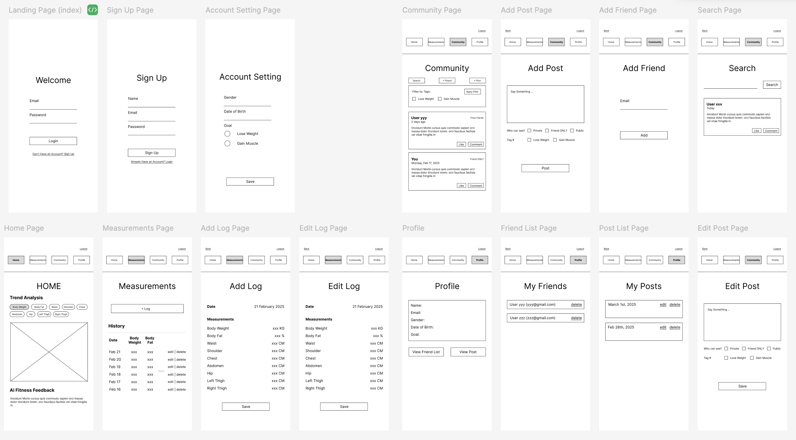

# Web Application Exercise

A little exercise to build a web application following an agile development process. See the [instructions](instructions.md) for more detail.

## Product vision statement

Our Weight Tracker & Body Dimension App helps fitness people track their journey to healthier body shapes by recording and analyzing body measurements over time with seamless logging, data visualization for tracking, and personalized AI insights, ensuring an intuitive and effective experience with database-driven tracking and management.
## User stories
[Issue Page](https://github.com/software-students-spring2025/2-web-app-mangopi/issues)
1. **User Authentication**: As a fitness person, I want to securely log in and access my account, so that I can track my progress, interact with the community, and manage my data.
2. **Progress Overview**: As a fitness person, I want to see an overview of my progress on the dashboard, so that I can track my weight loss or body changes over time.
3. **Progress Analysis**: As a fitness person, I want to receive automated analysis and feedback on my progress so that I can make informed adjustments to my fitness routine.
4. **Logging Data**: As a fitness person, I want to log my weight and/or body measurements, so that I can track my weight loss or muscle growth progress accurately.
5. **Viewing Past Entries**: As a fitness person, I want to view my past entries, so that I can analyze trends and stay motivated.
6. **Editing Entries**: As a fitness person, I want to edit my past weight or measurement entries, so that I can correct any mistakes in my logs.
7. **Deleting Entries**: As a fitness person, I want to delete an entry if I recorded incorrect data, so that my progress tracking remains accurate.
8. **Community & Support**: As a fitness person, I want to connect with friends and share my progress, so that we can support each other and reflect on our fitness journeys together.

_Dieter-Specific Features_
9. **Filtering Diet Content**: As a dieter, I want to filter and search for diet and weight loss-related posts, so that I can easily find relevant tips, insights, and motivation for my journey.

_Muscle Growth-Specific Features_
10. **Filtering Muscle Growth Content**: As a person who works out for muscle growth, I want to filter and search for muscle-building-related posts, so that I can easily find relevant tips, workouts, and nutrition advice to support my progress.

## Steps necessary to run the software

1. **Clone the Repository**  

   ```bash
   git clone https://github.com/software-students-spring2025/2-web-app-mangopi.git
   cd 2-web-app-mangopi

2. **Set a Virtual Environment**


    Create and activate a Conda environment, then install dependencies:

    ```bash
    conda create -n mangopi_env python=3.12
    conda activate mangopi_env
    pip install -r requirements.txt

3. **Configure Environment Variables**

    Create a .env file in the project root and add the following (adjust values as needed):

    ```bash
    SECRET_KEY=your-secret-key
    MONGO_URI=your-mongodb-connection-string
    MONGO_DBNAME=your-database-name
    OPENAI_API_KEY=your-openai-api-key
    FLASK_PORT=5001   

4. **Run the client**

    To run the application in normal mode (using the logged-in user’s data):

    ```bash
    python app.py
    ```
    
    To run the application in DEMO mode (forcing a fixed user id, e.g. “12345”, for testing):

    ```bash
    python app.py --demo_mode
    ```
    
If you have any questions or need access to our database, please contact zz4330@nyu.edu.

## Task boards
[Sprint 1](https://github.com/orgs/software-students-spring2025/projects/18): We focused on familiarizing ourselves with MongoDB and Flask. Together, we worked on the login/signup page and the add_log page (user story #1 and #4) to ensure everything was functioning properly.

[Sprint 2](https://github.com/orgs/software-students-spring2025/projects/103): We divided tasks based on functionality, with each team member working on a specific feature. We also introduced a new user story (#3) at this stage to enhance the user experience.

## Wireframes
[Figma link](https://www.figma.com/design/dU1VURpoqFCAoaFis3S6kL/mangopi?node-id=0-1&t=Xblr9685IqmDrrvM-1)



